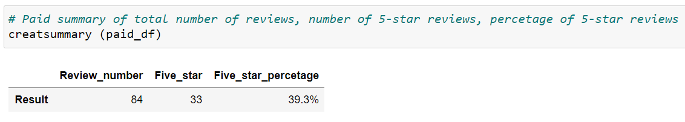
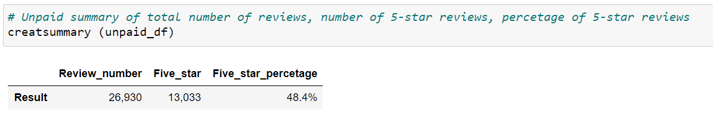
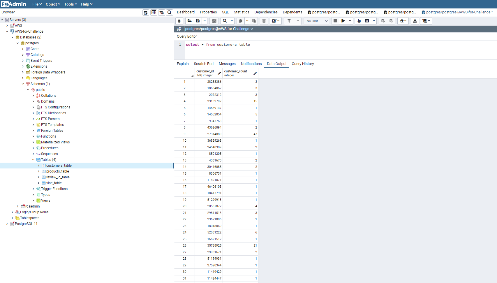
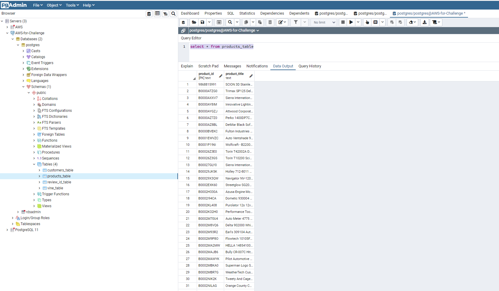
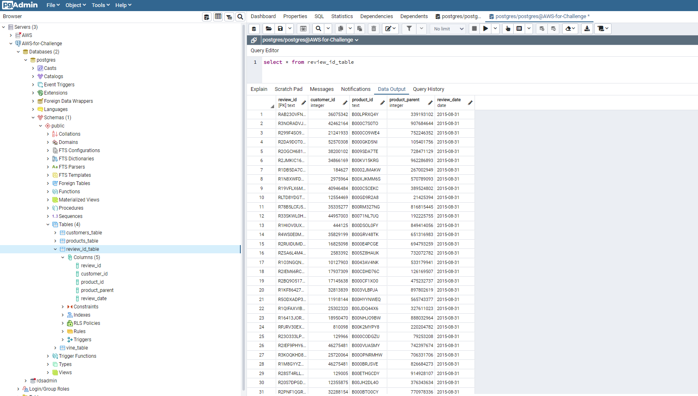
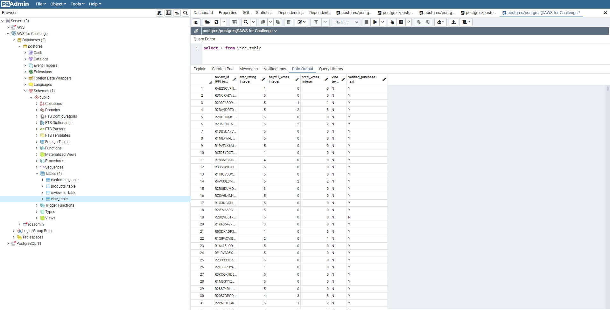

# Amazon_Vine_Analysis

## Overview of the analysis
   The analysis is to help Jennifer to evaluate if there is any bias toward favorable reviews from Vine members. Companies like SellBy pay a small fee to Amazon and provide products to Amazon Vine members, who are then required to publish a review. 
   The analysis focused on Automotive product. First, we used PySpark to perform the ETL process to extract the dataset, transform the data, connect to an AWS RDS instance, and load the transformed data into pgAdmin. Next, we used Pandas to analyze if having a paid Vine review makes a difference in the percentage of 5-star reviews.

## Results

**1. How many Vine reviews and non-Vine reviews were there?**

There were 84 paid Vine reviews and there were 26,930 non-Vine reviews.

**2. How many Vine reviews were 5 stars? How many non-Vine reviews were 5 stars?**

There were 33 five stars in paid Vine reviews and were 13,033 five stars in non-Vine reviews.

**3. What percentage of Vine reviews were 5 stars? What percentage of non-Vine reviews were 5 stars?**

39.3% of reviews was five stars in Vine reviews and 48.4% of reviews was five stars in non-Vine reviews.

## Summary
   Although the percentage of five stars review from Vine member, 39.3%, is smaller than non-Vine member, 48.4%, we should not jump into the conclusion that there is no positivity bias in the Vine program. It is because that there are only 84 reviews samples from Vine members which is relatively small. 
   We need to collect more data to run the same analysis again to see if there is any positivity bias for reviews in the Vine program. However, in my option, it is a bit arbitrary to judge only by five stars rating. Vine member might leave positive comments more than non-Vine without giving five stars rating. At the same time, I would like to Tokenize on review_headline and review_body, and label out positive and negative word to examine if Vine members are more likely to leave positive reviews than non-Vine.

## Addendum

Here are the screen shots that DataFrames were loaded into the correspond tables in pgAdmin.

